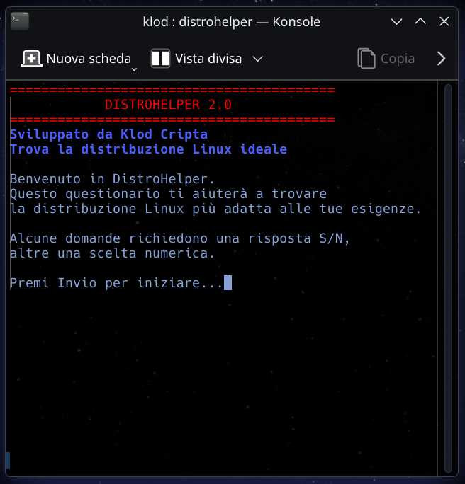
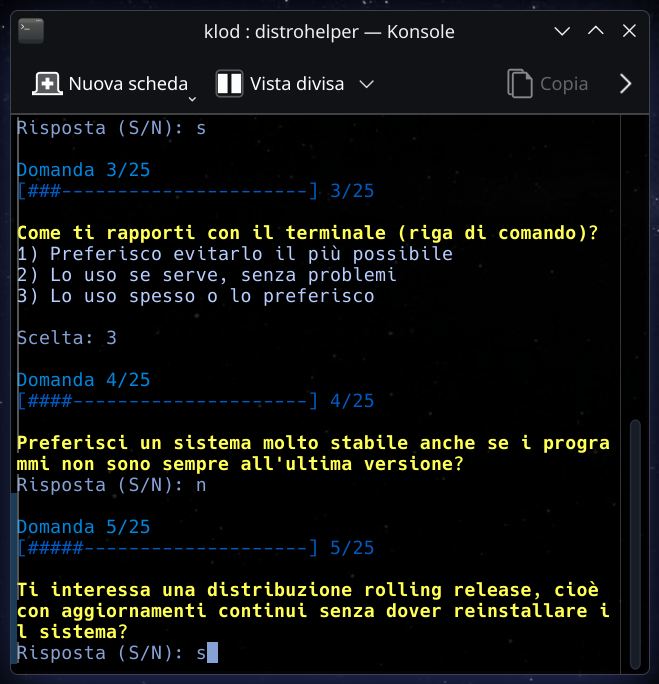
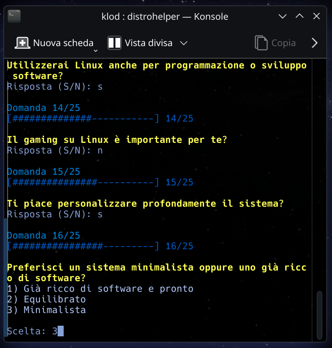
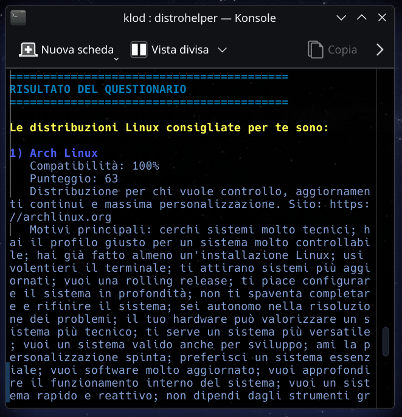

<p align="center">
  
</p>

<h1 align="center">DistroHelper 2.0</h1>

<p align="center">
An interactive Bash tool that helps users choose the GNU/Linux distribution that best fits their needs.
</p>

<p align="center">
  <a href="https://aur.archlinux.org/packages/distrohelper">
    
  </a>
  <a href="LICENSE">
    
  </a>
  
</p>

---

DistroHelper 2.0 è uno script Bash che guida l’utente nella scelta della distribuzione GNU/Linux più adatta alle proprie esigenze.

Attraverso un questionario interattivo analizza il profilo dell’utente e suggerisce **tre distribuzioni Linux** compatibili con le sue preferenze, mostrando per ciascuna una breve descrizione e il link al sito ufficiale.

Il progetto è nato come esperimento personale scritto interamente in Bash.
# Caratteristiche

- Questionario interattivo
- Risposte miste: sì/no e scelte numeriche
- Suggerisce le 3 distribuzioni GNU/Linux più adatte
- Mostra una percentuale di compatibilità
- Fornisce una breve descrizione per ogni distribuzione consigliata
- Interfaccia da terminale con barra di avanzamento

---

## Screenshots

<p align="center">
  
  
</p>

<p align="center">
  
  
</p>

---

# Utilizzo (metodo consigliato)

Per garantire la massima trasparenza, il metodo consigliato consiste nel clonare il repository e ispezionare lo script prima dell’esecuzione.

```bash
git clone https://github.com/KlodCripta/DistroHelper.git
cd DistroHelper
chmod +x distrohelper.sh
./distrohelper.sh
```

Questo approccio consente all’utente di verificare completamente il codice prima dell’esecuzione, in linea con la filosofia di Arch Linux e del software libero.

# Licenza

Questo progetto è distribuito con licenza MIT. Per i dettagli vedere il file LICENSE.

# Autore

Sviluppato da Klod Cripta.
Contributi, segnalazioni e suggerimenti sono benvenuti.

Puoi contattare Klod Cripta tramite email KlodCripta@linux.it
